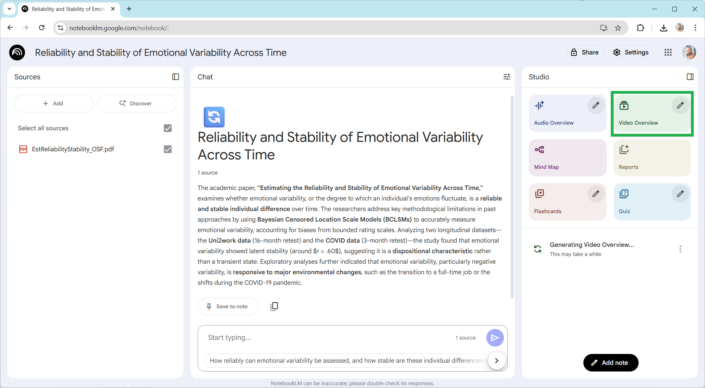

# Video Overviews of Scientific Papers

In this exercise, we will create a video overview of a scientific publication. For this, you need a Google account.

⦁ Log in to [NotebookLM](https://notebooklm.google/)

⦁ Upload a recent publication of your own or a recently read paper. Pay attention to copyright. If the publication or preprint was published under a CC-BY 4.0 license, for example, you may do this completely legally.

This will take a while. Come back in the next exercise block and watch the video. Does everything that is said there make sense?