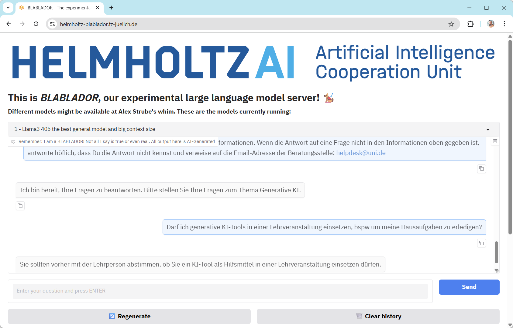
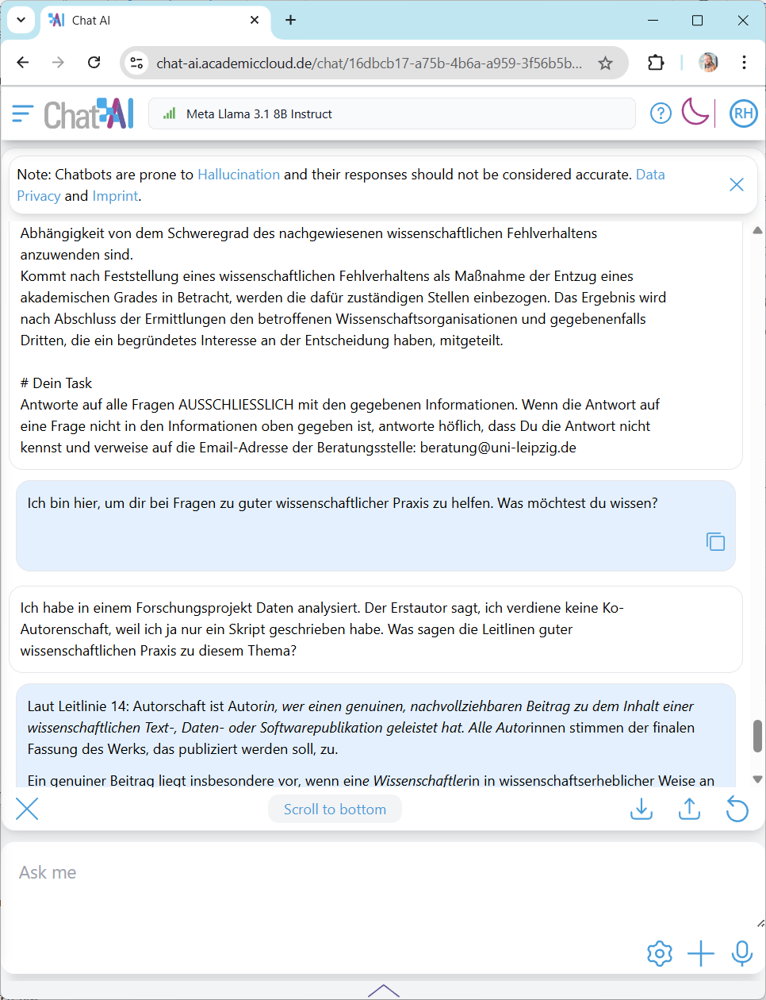
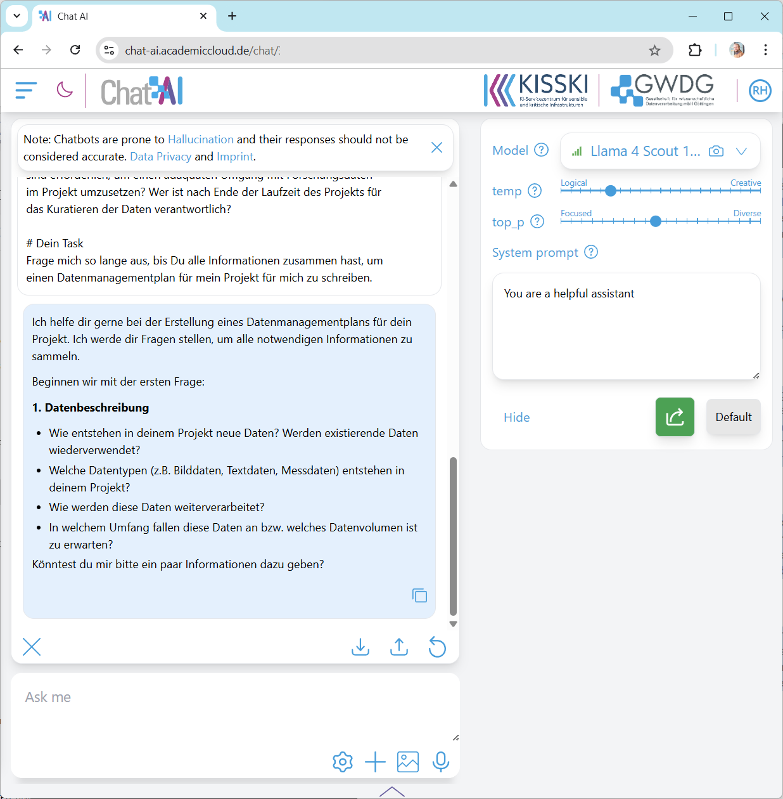

# Creating Your Own Chatbot

In this exercise, we will instruct a chatbot so that the system can answer questions regarding a specific topic. We can then compare the system with existing chatbots on the same topic.

## The Task

Write a system prompt as described below and start a chat. Ask questions from the given context and verify whether the answer was actually generated from the given knowledge base. Also ask about topics outside the subject area: Can the chatbot specialized in Good Scientific Practice write cooking recipes? Can a chatbot specialized in data management plans also provide information about regional excursion destinations?

## How to Do It

For the chatbot to act as an expert in a domain, the system needs appropriate instructions and detailed information - a knowledge base.

```
You are a polite and helpful assistant who can help with questions on the topic <TOPIC>. 
You have the following information available:

<INFORMATION>

# Your Task

Answer all questions EXCLUSIVELY with the given information. 
If the answer to a question is not given in the information above, respond politely 
that you don't know the answer and refer to the email address of the advisory service: <EMAIL>
```

Copy this prompt into a shared document and replace the `<PLACEHOLDERS>` with concrete text. Then copy the prompt into the corresponding ChatApp at the **beginning of a new discussion**.

## Topics

Various topics are available for this exercise:
* [Professional Ethical Guidelines for Psychologists](https://www.dgps.de/die-dgps/aufgaben-und-ziele/berufsethische-richtlinien/)
* [Use of Generative AI](nutzung_genki.docx)
* [Guidelines for Safeguarding Good Scientific Practice](dfg_kodex_excerpt.docx)
* [Checklist for Handling Research Data](checkliste_dmp.docx)
* [Regulation of the Saxon State Ministry for Science, Culture and Tourism on the Award of Saxon State Scholarships](saechslstipvo.docx)

## AI Systems

These systems can be used to implement the modified chatbot:
* [GWDG Kisski Chat AI (Academic Cloud)](https://chat-ai.academiccloud.de/)
* [Helmholtz Blablador](https://helmholtz-blablador.fz-juelich.de/)
* [ChatGPT](https://chat.openai.com/)
* [Claude](https://claude.ai)
* [Gemini](https://gemini.google.com/app)

## Notes

Extend the prompt with additional instructions, such as:
* `You are a lawyer specializing in <TOPIC> and respond in language typical of lawyers.`
* `You are a secondary school teacher and respond in language that is understandable for teenagers.`
* `The answers must be SUPER exact and ideally verbatim quotes (with source citations).`
* `It is SUPER SUPER IMPORTANT that the answers are correct. If I get something wrong here, I will be fired.`

Change the perspective of the discussion. For example, instruct the ChatApp as follows:
```
You are a consultant on the topic <TOPIC>.
We need to create a <DOCUMENT>.
Keep asking me questions until you have gathered all the information 
to write <DOCUMENT> for me.
```

## Examples

### Use of Generative AI

 

### Good Scientific Practice



### Writing a DMP

